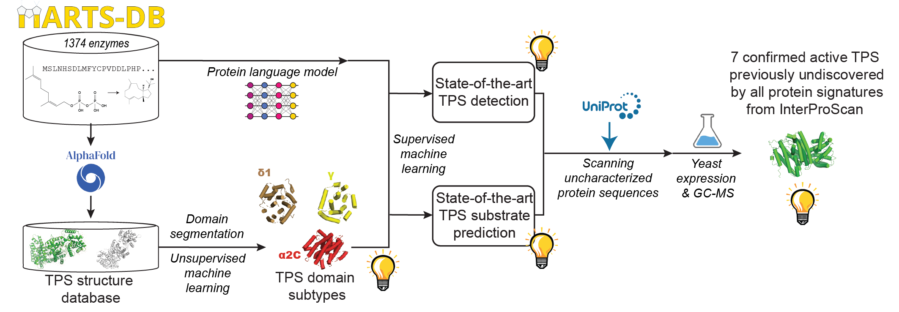

[](https://github.com/ambv/black)
[](https://github.com/pluskal-lab/EnzymeExplorer/actions/workflows/ci.yml)
[](https://doi.org/10.1101/2024.01.29.577750)
[](https://colab.research.google.com/github/pluskal-lab/EnzymeExplorer/blob/main/notebooks/EnzymeExplorer_(input_UniProt_ID).ipynb)

<div align="center">

# Structure-enabled enzyme function prediction unveils elusive terpenoid biosynthesis in archaea


</div>

-----------------------------------------

## 🚀 Try it in a Colab notebook

| Input                                     | Colab Notebook                                                                                                                                                                                                                                       |
|-------------------------------------------|------------------------------------------------------------------------------------------------------------------------------------------------------------------------------------------------------------------------------------------------------|
| UniProt ID                                | [](https://colab.research.google.com/github/pluskal-lab/EnzymeExplorer/blob/main/notebooks/EnzymeExplorer_(input_UniProt_ID).ipynb)                                                     |
| Protein structure                         | [](https://colab.research.google.com/github/pluskal-lab/EnzymeExplorer/blob/main/notebooks/EnzymeExplorer_(upload_your_structure).ipynb)                                                |
| Sequence (structure folded via ColabFold) | [](https://colab.research.google.com/github/pluskal-lab/EnzymeExplorer/blob/main/notebooks/EnzymeExplorer_%2B_ColabFold_(input_sequence).ipynb)                                         |

-----------------------------------------

## Contents

- [Introduction](#introduction)
- [Installing EnzymeExplorer](#installing-enzymeexplorer)
  - [Prerequisites](#prerequisites)
  - [Prediction-only host (lean install)](#prediction-only-host-lean-install)
  - [Full developer host (training + evaluation + screening)](#full-developer-host-training--evaluation--screening)
  - [Google Drive URLs (`drive/bundles.json`)](#google-drive-urls-drivebundlesjson)
- [Local prediction](#local-prediction)
- [Reproducing the paper end-to-end](#reproducing-the-paper-end-to-end)
  - [Preparing the training corpus](#preparing-the-training-corpus)
  - [Detecting TPS-family structural domains](#detecting-tps-family-structural-domains)
  - [Clustering the detected domains + identifying subtypes](#clustering-the-detected-domains--identifying-subtypes)
  - [Extracting per-protein features](#extracting-per-protein-features)
  - [Training the classifiers](#training-the-classifiers)
  - [Evaluating classifier performance](#evaluating-classifier-performance)
  - [Calibrating classifier scores](#calibrating-classifier-scores)
- [Discovery pipelines](#discovery-pipelines)
  - [Curated candidate showcases](#curated-candidate-showcases)
  - [Screening the dark proteome](#screening-the-dark-proteome)
  - [Screening the GTDB archaeal proteomes](#screening-the-gtdb-archaeal-proteomes)
- [Rebuttal-only analyses](#rebuttal-only-analyses)
- [Deploying as a backend service](#deploying-as-a-backend-service)
- [Reference](#reference)

-----------------------------------------

## Introduction

Terpene Synthases (TPSs) generate the scaffolds of the largest class of natural products (more than 96,000 compounds), including several first-line medicines. They are responsible for most of the natural scents humans have ever encountered [[1]](https://pubmed.ncbi.nlm.nih.gov/21114471/), and for the Nobel-prize-winning antimalarial artemisinin [[2]](https://www.ncbi.nlm.nih.gov/pmc/articles/PMC4966551/) and the anticancer drug taxol [[4]](https://pubmed.ncbi.nlm.nih.gov/33348838/).

This repository accompanies **[*Structure-enabled enzyme function prediction unveils elusive terpenoid biosynthesis in archaea*](https://www.biorxiv.org/content/10.1101/2024.01.29.577750)**. It contains the full ML pipeline — from raw MARTS-DB curation to the trained model, calibration, and dark-proteome screening — reorganised so every step is reproducible from a single command.

Highlights:

- Substantially outperforms every published TPS-detection baseline (BLAST, HMM, Foldseek, CLEAN, Pfam+SUPFAM signatures).
- Identified and experimentally validated seven previously-unknown TPS enzymes that InterProScan misses.
- First demonstration of functional terpene cyclization in Archaea, revealing a hitherto-hidden branch of TPS biology.
- New TPS structural domain plus refined subtypes of the known α/β/γ/δ/ε/ζ folds.

Although the paper is TPS-focused, the pipeline is enzyme-family-agnostic: replacing the input CSV + domain templates repurposes it for any other family.

-----------------------------------------

## Installing EnzymeExplorer

Two setup scripts cover the two most common host types. Both are self-contained and safe to re-run.

### Prerequisites

- Linux with `conda` (Miniconda or Mambaforge) on `PATH`.
- ~5 GB free for a prediction-only install; ~50 GB for the full developer install (data + trained-model checkpoints).
- CUDA-capable GPU is optional but strongly recommended for anything beyond one-off inference.

### Prediction-only host (lean install)

```bash
git clone https://github.com/pluskal-lab/EnzymeExplorer.git
cd EnzymeExplorer
scripts/setup_prod.sh                    # default: --env-name enzyme_explorer_prod --cuda cu124
# scripts/setup_prod.sh --cpu            # CPU-only wheels for PyTorch
# scripts/setup_prod.sh --force          # rebuild env + re-download bundles
conda activate enzyme_explorer_prod
```

`setup_prod.sh` provisions a minimal conda environment with PyMOL + foldseek + USalign, installs the runtime pip dependencies, and downloads every Google-Drive artifact tagged `prod` in `drive/bundles.json`:

- deploy-side prediction bundles (`enzyme_explorer_checkpoints.pkl`, `enzyme_explorer_plm_checkpoints.pkl`, `calibration_fit_summary.csv`)
- MARTS-DB reference domains + prebuilt foldseek DB cache
- Pinned `foldseek` and `USalign` binaries
- Curated AlphaFold-DB structures for the discovered dark- and Pfam/SUPFAM-selected candidates.

**Try it immediately on the shipped candidate sets.** After `setup_prod.sh` finishes, both curated candidate sets live in the repo — the FASTAs are committed, and the AF-DB structures came in via the `candidate-structures` Drive bundle. Predict on them with a single command each:

```bash
# Pfam+SUPFAM-selected candidates (9 sequences)
enzyme_explorer_main predict \
    --sequences        data/pfam_supfam_candidates/candidates.fasta \
    --structures-dir   data/pfam_supfam_candidates/afdb \
    --output-dir       outputs/candidates/pfam_supfam_candidates

# Dark-proteome-selected candidates (11 sequences)
enzyme_explorer_main predict \
    --sequences        data/dark_candidates/candidates.fasta \
    --structures-dir   data/dark_candidates/afdb \
    --output-dir       outputs/candidates/dark_candidates
```

The one-line wrappers `scripts/run_pfam_supfam_candidates.sh` and `scripts/run_dark_candidates.sh` are exactly these calls, pre-baked — either the wrappers or the raw commands above work.

**Files produced.** Each `predict` invocation writes two CSVs into `--output-dir`:

- **`predictions_plm_domains.csv`** — proteins whose AF-DB structure yielded a meaningful match to the training-time reference domains and were routed through the domain-aware PlmDomainsRandomForest ensemble. This is the primary output; for the two candidate sets above, every protein ends up here.
- **`predictions_plm_only_fallback.csv`** — proteins whose domain features were empty or below the foldseek meaningfulness threshold; the pipeline falls them back to the sequence-only PlmRandomForest ensemble instead. Empty in the two candidate examples above because every candidate has meaningful domains.

Both files share the same wide-form schema, in this fixed column order:

| Column block | Columns |
|---|---|
| id | `id` |
| Calibrated per-class probabilities (`<class>_p`) | `TPS_p`, `GPP_p`, `FPP_p`, `GGPP_p`, `GFPP_p`, `CPP_p`, `EDSQ_p`, `2xFPP_p`, `2xGGPP_p`, `IDS_p` |
| Raw per-class scores (`<class>_raw`, uncalibrated) | `TPS_raw`, `GPP_raw`, `FPP_raw`, `GGPP_raw`, `GFPP_raw`, `CPP_raw`, `EDSQ_raw`, `2xFPP_raw`, `2xGGPP_raw`, `IDS_raw` |
| sequence | `sequence` |

Class-order rationale: `TPS` first because it's the overall Class-I/II TPS-vs-non-TPS gate; the substrates follow ordered by carbon count (mono → sesq → di → sester → tri → tetra) with the two "2x" homo-dimers grouped last, and `IDS` (isoprenyl diphosphate synthase, i.e. non-cyclising) at the very end. The two blocks (`_p` then `_raw`) are separated so downstream consumers can pick the calibrated column contiguously.

Each `<class>_p` value is a probability in `[0, 1]` produced by a per-class beta calibrator fitted at deployment time (see `data/calibration_fit_summary.csv`). A class whose calibrator was skipped at training time (insufficient positives) will show `NaN` in its `_p` column — the raw score is still populated.

### Full developer host (training + evaluation + screening)

```bash
scripts/setup_dev.sh                     # default: --env-name enzyme_explorer_dev --cuda cu124
# scripts/setup_dev.sh --skip-drive      # env only, no downloads
# scripts/setup_dev.sh --skip-pdbs       # skip the ~48k AF-DB PDB pull
# scripts/setup_dev.sh --skip-gtdb       # skip the GTDB archaeal-tree fetch
# scripts/setup_dev.sh --skip-clean      # skip cloning + building CLEAN in-tree
conda activate enzyme_explorer_dev
```

Adds to the prod install:

- Development toolchain (`mmseqs2`, `mafft`, `iqtree2`, rdkit pinned to `2022.9.5`, jupyter, seaborn, plotly, umap-learn, HDBSCAN, GOATools 1.6.5, dynamicTreeCut, ProFun, fair-esm).
- Every Google-Drive artifact tagged `dev`: PLM checkpoints, pre-gathered PLM embeddings (`.h5`), structural-features matrix, SwissProt export, MARTS-DB PDBs, domain-clustering all-vs-all USalign cache, additional detected-domain sets, dark-proteome screening result, per-family trained-fold checkpoints (`outputs/models/*`), and the pinned GO ontology.
- `data/enzyme_explorer_pdbs/` — populated by copying `marts_*` PDBs out of the extracted MARTS-DB set and downloading every other UniProt ID via the AlphaFold-DB v6 URL (with a REST-API fallback for older-version entries). Missing entries are logged in `data/enzyme_explorer_pdbs/_download_manifest.csv` and skipped.
- `data/archaeal_screening/{ar53,ar53_clean}.tree` — pulled from GTDB and post-processed for iTOL compatibility by `scripts/archaeal_screening/download_gtdb_ar53_tree.sh`.

Optional convenience download — **not required by any script**, only useful if you want to skip the MMseqs2 CLEAN dataprep step: the CLEAN retraining datasets (per-fold train CSVs + test FASTAs, ~511 MB) are hosted on [Google Drive](https://drive.google.com/file/d/1TfxtmZCeWgqD6gkOp3n0P7V3yXdf280f/view?usp=sharing). Download the zip file yourself and drop the archive at `data/clean_datasets/` (see `enzymeexplorer/src/data_preparation/clean_dataset_prep.py` for the schema).

### Google Drive URLs (`drive/bundles.json`)

Every downloadable artifact lives at a Drive URL declared in a single JSON file. The setup scripts read it via `scripts/drive_helper.py`, which handles both `type: zip` (with per-entry `MANIFEST.txt` sha256 verification) and `type: raw` (single-file downloads). To inspect or drive downloads manually:

```bash
python -m scripts.drive_helper list --required-by prod          # or dev / all
python -m scripts.drive_helper install-all --required-by prod   # download+verify+extract
python -m scripts.drive_helper install <bundle_name>            # a single bundle
python -m scripts.drive_helper verify <bundle_name>             # run only sanity_checks
```

To (re)produce the zips locally from your data tree before uploading a fresh copy to Drive, `scripts/build_drive_bundles.py` reads the same JSON and writes zips into `drive/`.

-----------------------------------------

## Local prediction

After `setup_prod.sh` (or `setup_dev.sh`) finishes, `enzyme_explorer_main predict` is on `$PATH`.

**Structure-aware (recommended when AlphaFold-DB predictions are available):**

```bash
enzyme_explorer_main predict \
    --sequences path/to/input.fasta \
    --structures-dir path/to/pdbs/ \
    --output-dir path/to/output/
```

This writes two CSVs to `--output-dir`:

- `predictions_plm_domains.csv` — hits routed through the domain-aware PlmDomainsRandomForest ensemble.
- `predictions_plm_only_fallback.csv` — proteins whose domain features weren't meaningful; scored by the sequence-only PLM ensemble instead.

Column schema of both files: `id`, per-class calibrated probabilities in the fixed order **TPS, GPP, FPP, GGPP, GFPP, CPP, EDSQ, 2xFPP, 2xGGPP, IDS** (`<class>_p`), followed by the raw per-class scores in the same order (`<class>_raw`), followed by the sequence.

**Sequence-only (no structures required):**

```bash
enzyme_explorer_main predict \
    --no-structures \
    --sequences path/to/input.fasta \
    --output-csv predictions.csv
```

**Domain-detection defaults**: no pre- or post-filtering, one domain per iteration. If you're deliberately hunting multi-domain proteins, opt in via `--detect-multiple-domains-in-each-iteration`. Similarly, `--prefilter-pdbs-by-foldseek` and `--postfilter-domains-by-foldseek` are available.

The dedicated `predict_with_structures` and `predict_sequences_only` console scripts remain available for backwards compatibility.

-----------------------------------------

## Reproducing the paper end-to-end

The steps below use the `enzyme_explorer` dev environment. Everything writes into `outputs/…/`; every step is idempotent.

### Preparing the training corpus

MARTS-DB reactions are cleaned + deduplicated, negative examples are sampled from SwissProt, and the resulting dataset is clustered by MMseqs2 into a group-stratified 5-fold split.

```bash
# Clean the raw MARTS-DB reactions table (family-specific — output is
# data/EnzymeExplorer_Dataset.csv + data/EnzymeExplorer_Dataset_TPS.csv).
python -m enzymeexplorer.src.data_preparation.prepare_dataset

# Optional — sample fresh negatives from SwissProt.
get_uniprot_sample \
    --uniprot-fasta-path data/uniprot_sprot.fasta \
    --output-path data/sampled_id_2_seq.pkl \
    --sample-size 10000

# 50%-identity clusters used everywhere as leakage-preventing groups.
# Produces data/EnzymeExplorer_Dataset_clusters_50.tsv.
python scripts/build_dataset_clusters.py
```

The three key inputs (`data/EnzymeExplorer_Dataset.csv`, `EnzymeExplorer_Dataset_TPS.csv`, `EnzymeExplorer_Dataset_clusters_50.tsv`) are also committed to the repo for convenience.

### Detecting TPS-family structural domains

Segments each AlphaFold structure into TPS-family domains (α, β, γ, ids, δ, ε, ζ). The default policy is **no heuristic filtering, one domain per iteration**; opt in to multi-domain detection via the flag when running on a curated set where you want every match.

```bash
enzyme_explorer_main detect_domains \
    -c enzymeexplorer/configs/enzyme_explorer_domain_detection_config.yaml \
    --detections-output-path data/detected_domains/enzyme_explorer_detected_domains/martsDB_detected_domains.pkl \
    --detected-regions-root-path data/detected_domains/enzyme_explorer_detected_domains/detections \
    --domains-output-path data/detected_domains/enzyme_explorer_detected_domains/domains \
    --n-jobs 16 \
    --input-directory-with-structures data/enzyme_explorer_pdbs/
```

The `configs/*_domain_detection_config.yaml` files bundle the seven template PDBs and their per-domain TM-score / min-align-length thresholds. See `enzymeexplorer/configs/dark_candidates_domain_detection_config.yaml` for a variant that turns multi-domain-per-iteration ON — useful when characterising a small curated set.

### Clustering the detected domains + identifying subtypes

Hierarchical agglomerative clustering (HAC) of the pairwise USalign TM-scores, followed by dynamicTreeCut for automatic cluster-cutoff selection, then subtype-labelling driven by `data/domain_subtype_label_overrides.json`.

```bash
bash scripts/run_domain_clustering.sh
```

Products land under `outputs/domain_clustering/` (intermediate all-vs-all + linkage matrices) and `outputs/martsdb/phylogeny/` (iTOL annotations for the MARTS-DB TPS phylogeny). The USalign all-vs-all cache lives in `data/domain_clustering/all_vs_all/` — precomputed and shipped via Drive.

### Extracting per-protein features

**PLM embeddings** (one file per PLM under `data/gathered_embs_*_embs_avg.h5`):

```bash
bash scripts/extract_all_embeddings.sh
```

Covers the six PLMs used in the paper: `ankh_base`, `ankh_large`, `ankh_tps` (finetuned), `esm-1v`, `esm-1v-finetuned-subseq`, `esm-2-t36-L36`. Pre-computed `.h5` files are shipped via Drive.

**Foldseek structural features** (per-protein × per-template TM-score matrix — `data/enzyme_explorer_structural_features/`):

```bash
python -m enzymeexplorer.src.structure_processing.get_structural_features \
    --query-domains-file-path data/detected_domains/enzyme_explorer_detected_domains/martsDB_detected_domains.pkl \
    --reference-domains-file-path data/detected_domains/martsDB_detected_domains/martsDB_detected_domains.pkl \
    --query-domains-structures-directory data/detected_domains/enzyme_explorer_detected_domains/domains \
    --reference-domains-structures-directory data/detected_domains/martsDB_detected_domains/domains \
    --output-directory data/enzyme_explorer_structural_features
```

### Training the classifiers

Every family × PLM combination is described by a YAML config under `enzymeexplorer/configs/<Family>/<Version>/config.yaml`. Trained fold checkpoints go to `outputs/models/<Family>/<Version>/…/model_fold_<N>.pkl`.

```bash
# All configured models (a config with .ignore suffix is skipped).
bash scripts/run_training.sh --families all

# One family at a time (subset one or many).
bash scripts/run_training.sh --families PlmDomainsRandomForest
bash scripts/run_training.sh --families Blastp,HMM,Foldseek,PfamSUPFAM,CLEAN

# Or the low-level single-experiment flow (interactive picker).
enzyme_explorer_main --select-single-experiment run
```

Baseline sweeps (Pfam+SUPFAM bit-score, Foldseek e-value, BLAST e-value, HMM cross-validation) live at `enzymeexplorer/configs/{Blastp,HMM,Foldseek,PfamSUPFAM}/*_bitscore*/config.yaml`; each sweep config inherits from the family's `main_config.yaml` via `include:`.

### Evaluating classifier performance

The evaluation pipeline runs cluster-block paired bootstrap (BCa CIs) across the resolved-per-class classifier set. Configs are under `enzymeexplorer/configs/evaluation/`.

```bash
# One-shot all four canonical eval configs + the homology sweep.
bash scripts/run_evaluation.sh --all

# Or one config at a time.
enzyme_explorer_main evaluate \
    --config enzymeexplorer/configs/evaluation/all_methods_comparison/main.yaml \
    --output-name all_methods_comparison
enzyme_explorer_main visualize --eval-output-name all_methods_comparison
```

Outputs land under `outputs/evaluation_results/<output_name>/`:

- `summary_ap.csv`, `summary_delta.csv`, `pvalues.csv` — per-class + per-aggregate BCa CIs, Holm-adjusted p-values.
- `bootstrap_long_ap.csv`, `bootstrap_long_delta.csv` — per-draw records (for reproducing the paper CIs).
- `plots/…` — the paper-facing bar-charts + macro-averaged PR/ROC curves.

The bootstrap cache (`outputs/evaluation_results/_bootstrap_cache/`) is keyed by the classifier fingerprints × RNG params × cluster-map hash + a bumpable algorithm version — subsequent runs with the same set reuse the same draws.

### Calibrating classifier scores

Per-(classifier, class) beta calibrators fitted on pooled OOF predictions with LOFO family selection and cluster-bootstrap CIs.

```bash
bash scripts/run_calibration.sh                     # canonical
bash scripts/run_calibration.sh --sanity <suffix>   # side-by-side rerun without clobbering data/
```

Products at `outputs/evaluation_results/calibration/`:

- `calibration/fit_summary.csv` — deployable calibrator per (classifier, class) with grade (`fit`, `fit_borderline`, `fit_caveat`, `fit_fold_drift`, `skipped_low_n_pos`).
- `plots/calibration/` — reliability diagrams, per-fold parameter drift, hard-error inspection panels.
- After a successful run the fit summary is auto-published to `data/calibration_fit_summary.csv` (the file the prediction pipeline reads by default). Use `--sanity` to run without publishing.

-----------------------------------------

## Discovery pipelines

### Curated candidate showcases

Two hand-picked candidate sets act as end-to-end sanity checks of the release model.

**Pfam+SUPFAM-selected candidates** (nine sequences — the highest-phylogenetic-distance hits from a Pfam PF01397 + PF03936 / SUPFAM sf48239 + sf48576 screen of ~5.1 B sequences across BFD, UniParc, MGnify, 1KP, Phytozome, and NCBI TSA):

```bash
bash scripts/run_pfam_supfam_candidates.sh
# → outputs/candidates/pfam_supfam_candidates/predictions_plm_domains.csv
```

**Dark-proteome-selected candidates** (eleven sequences — sampled by hand from clades of the dark-proteome phylogenetic tree; see the next subsection for how they were produced):

```bash
bash scripts/run_dark_candidates.sh
# → outputs/candidates/dark_candidates/predictions_plm_domains.csv
```

### Screening the dark proteome

The dark proteome (UniProt entries without any InterPro annotation) was screened *outside* this repo — the resulting 307,077-row scored CSV is shipped via Drive as `data/dark_proteome_screening/dark_proteome_screening.csv` and is `.gitignore`'d. What the repo contains is the downstream pipeline:

1. **Filter** at `TPS_p > 0.95` → 1,056 dark putatives (`data/dark_proteome_screening/dark_putatives.csv`, kept in-tree).
2. **Phylogeny** of dark putatives + MARTS-DB TPSs (MAFFT `--auto` + IQ-TREE `-fast LG+G4`) — see `scripts/dark_proteome_screening/build_tree.sh` and its outputs under `data/dark_proteome_screening/candidate_selection/phylo_tree/`.
3. **Candidate selection** — clade-based sampling from the tree (results in `data/dark_candidates/{candidates.fasta,afdb/}`).
4. **Structure-aware re-evaluation** on the final candidates — `scripts/run_dark_candidates.sh`.

iTOL annotations for the selection tree (kingdom colorstrip, source colorstrip, hard-candidate triangles, patristic-distance bars) are regenerated by:

```bash
python -m scripts.dark_proteome_screening.compute_distances
python -m scripts.dark_proteome_screening.build_itol_annotations
```

### Screening the GTDB archaeal proteomes

The archaeal proteome screening was also done outside the repo; shipped products are:

- `data/archaeal_screening/gtdb_genome_TPS_hits.csv` — per-genome TPS-hit counts across three calibrated-probability tiers (`C95_count`, `C99_count`, `C99.95_count`).
- `data/archaeal_screening/archaeal_putatives.csv` — per-protein hit list.
- The GTDB ar53 phylogeny (raw `ar53.tree` + iTOL-loadable `ar53_clean.tree`) is auto-downloaded by `scripts/archaeal_screening/download_gtdb_ar53_tree.sh` (invoked from `setup_dev.sh`).

iTOL annotations (phylum colorstrip + three simplebars at `p ≥ {0.95, 0.99, 0.9995}`):

```bash
python -m scripts.archaeal_screening.build_iTOL_annotations
# → outputs/archaeal_screening/itol_archaea_*.txt
```

-----------------------------------------

## Rebuttal-only analyses

Everything under `scripts/rebuttal_only/` targets reviewer questions on the manuscript — nothing here is part of the paper's main-figure pipeline.

**Baseline evaluation on the dark candidates** (BLAST, Foldseek, HMM, Pfam, SUPFAM, CLEAN — per-fold predictions on the same 11 sequences the paper uses to sanity-check the release model):

```bash
bash scripts/rebuttal_only/dark_candidates_baselines/run_all.sh
# → outputs/rebuttal/dark_candidates_baselines/<Method>/{fold_0..4,mean}.csv
```

**Alpha-domain analysis of the three archaeal candidates** (A0A0E3NXY0, A0A5E4I9B1, A0A537EJD0 — cross-similarity + subtype PCA + novelty ridgeline panels):

```bash
python -m scripts.rebuttal_only.analyze_hard_domain A0A0E3NXY0 A0A5E4I9B1 A0A537EJD0
python -m scripts.rebuttal_only.analyze_three_cross_similarity
python -m scripts.rebuttal_only.plot_novelty_panels
python -m scripts.rebuttal_only.plot_A0A5E4I9B1_pca
python -m scripts.rebuttal_only.plot_three_pca
# → outputs/rebuttal/archaeal_alpha_domains/
```

**Pfam/SUPFAM screening of the dark proteome** — full reviewer-facing pipeline (HMM scan against the 1,056 dark putatives + full 307,077-sequence proteome, per-HMM-group analysis, AF-DB structure download + domain detection, δ-domain TM-score distribution, SUPFAM-only Foldseek clustering + t-SNE):

```bash
bash scripts/rebuttal_only/pfam_supfam_screening/run_all.sh
# → outputs/rebuttal/pfam_supfam_screening/
```

The thresholds live in one place — `scripts/rebuttal_only/pfam_supfam_screening/thresholds.py`. Current values: Pfam `loose = 10`, `optimized = 15` (from the corrected cross-validation sweep); SUPFAM `loose = 40`, `optimized = 50`. The scan scripts support `--skip-scan` so you can iterate on the summarisation without re-running the ~20-minute hmmscan against 307k sequences.

Supplementary CSVs — Pfam hits per HMM group with mean-pLDDT and (for SQHop_cyclase) domain composition — are produced by:

```bash
python -m scripts.rebuttal_only.pfam_supfam_screening.rebuttal_pfam_group_reports
```

-----------------------------------------

## Deploying as a backend service

Start the FastAPI service backed by the prod bundles:

```bash
conda activate enzyme_explorer_prod
export PORT=8000
nohup uvicorn app_faster_with_foldseek:app --host 0.0.0.0 --port "$PORT" &> webserver_app.log &
```

For a slower but slightly more accurate variant (no foldseek-based domain preselection):

```bash
nohup uvicorn app:app --host 0.0.0.0 --port "$PORT" &> webserver_app.log &
```

Both apps read the calibration table at `data/calibration_fit_summary.csv` and load the prediction bundles from `data/enzyme_explorer_{,plm_}checkpoints.pkl` — everything the prod install already put in place.

-----------------------------------------

## Reference

> Samusevich, R., Hebra, T. et al. Highly accurate discovery of terpene synthases powered by machine learning reveals
> functional terpene cyclization in Archaea. bioRxiv (2024). [https://doi.org/10.1101/2024.01.29.577750](https://doi.org/10.1101/2024.01.29.577750)

```
@article{samusevich2024tps,
  title={Highly accurate discovery of terpene synthases powered by machine learning reveals functional terpene cyclization in Archaea},
  author={Samusevich, Raman and Hebra, Teo and Bushuiev, Roman and Bushuiev, Anton and {\v{C}}alounov{\'a}, Tereza and Smr{\v{c}}kov{\'a}, Helena and Chatpatanasiri, Ratthachat and Kulh{\'a}nek, Jon{\'a}{\v{s}} and Perkovi{\'c}, Milana and Engst, Martin and Tajovsk{\'a}, Ad{\'e}la and others},
  journal={bioRxiv},
  pages={2024--01},
  year={2024},
  publisher={Cold Spring Harbor Laboratory}
}
```
