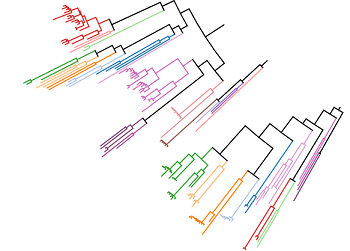
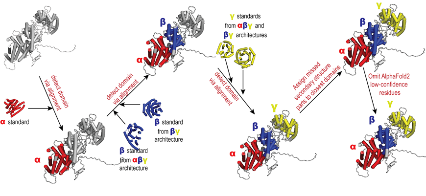
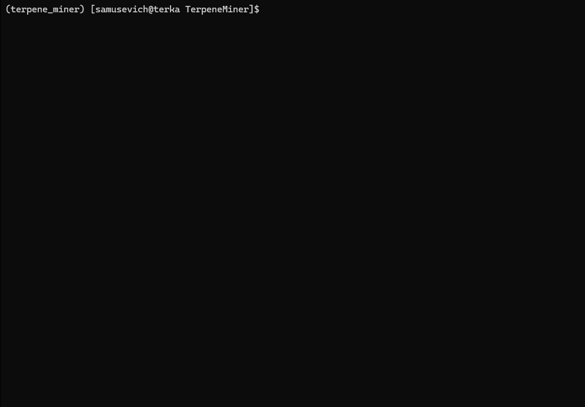
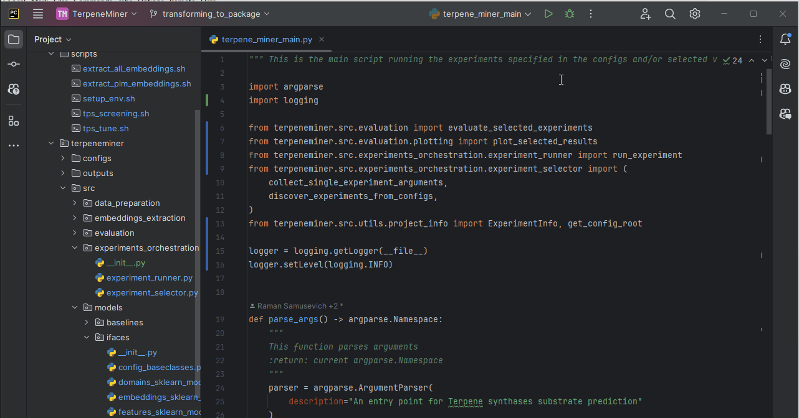

[](https://github.com/ambv/black)

[](https://github.com/samusram/tps_ml_discovery/actions/workflows/ci.yml)
<div align="center">

# Highly accurate discovery of terpene synthases powered by machine learning


</div>

## Introduction

Did you know that Terpene Synthases (TPSs) are responsible for the most natural scents humans have ever experienced [[1]](https://pubmed.ncbi.nlm.nih.gov/21114471/)? Among other invaluable molecules, TPSs are also responsible for the Nobel-prize-winning antimalarial treatment artemisinin [[2]](https://www.ncbi.nlm.nih.gov/pmc/articles/PMC4966551/) with a market size projected to reach USD 697.9 million by 2025 [[3]](https://www.ncbi.nlm.nih.gov/pmc/articles/PMC7309871/), or TPSs are accountable for the first-line anticancer medicine taxol with billion-dollar pick annual sales [[4]](https://pubmed.ncbi.nlm.nih.gov/33348838/).

Welcome to the GitHub repository showcasing state-of-the-art computational methods for Terpene Synthase (TPS) discovery and characterization. 


TPSs generate the scaffolds of the largest class of natural products (more than 96.000 compounds), including several first-line medicines [[5]](https://pubs.acs.org/doi/pdf/10.1021/acs.accounts.1c00296?casa_token=OzB4p1Y4nLoAAAAA:h85bm9CC10o33CQCMnhF1Th63mVD23YnnOGau7qhTjVhR7233XPV2-GS0LBDbIeQg-_LqjCS7ciCi7g). 
Our research, outlined in **[the accompanying paper *Highly accurate discovery of terpene synthases powered by machine learning reveals functional terpene cyclization in Archaea*](https://www.biorxiv.org/content/10.1101/2024.01.29.577750)**, addresses the challenge of accurately detecting TPS activity in sequence databases.

Our approach significantly outperforms existing methods for TPS detection and substrate prediction. Using it, we identified and experimentally confirmed the activity of seven previously unknown TPS enzymes undetected by all state-of-the-art protein signatures integrated into InterProScan. 

Notably, our method is the first to reveal functional terpene cyclization in the Archaea, one of the major domains of life [[6]](https://www.nature.com/articles/nrmicro.2017.133).
Before our work, it was believed that Archaea can form prenyl monomers but cannot perform terpene cyclization [[7]](https://academic.oup.com/femsre/article/47/2/fuad008/7081307). Thanks to the cyclization, terpenoids are the largest and most diverse class of natural products. Our predictive pipeline sheds light on the ancient history of TPS biosynthesis, which "is deeply intertwined with the establishment of biochemistry in its present form" [[7]](https://academic.oup.com/femsre/article/47/2/fuad008/7081307).

Furthermore, the presented research unveiled a new TPS structural domain and identified distinct subtypes of known domains, enhancing our understanding of TPS diversity and function.

This repository provides access to our approach's source codes. We invite researchers to explore, contribute, and apply our approach to other enzyme families, accelerating biological discoveries.


## Installation

```bash
git clone https://github.com/SamusRam/TPS_ML_Discovery.git

cd TPS_ML_Discovery

. src/setup_env.sh
```

## Workflow
### Data Preparation
#### 1 - Raw Data Preprocessing

```bash
cd TPS_ML_Discovery
conda activate tps_ml_discovery
jupyter notebook
```
Then execute the notebook `notebooks/notebook_1_data_cleaning_from_raw_TPS_table.ipynb`.

#### 2 - Sampling negative examples from Swiss-Prot
We sample negative (non-TPS) sequences from [Swiss-Prot](https://www.expasy.org/resources/uniprotkb-swiss-prot), the expertly curated UniProtKB component produced by the UniProt consortium. 
For reproducibility, we share the sampled sequences in `data/sampled_id_2_seq.pkl`. 

If you want to sample Swiss-Prot entries on your own, download Swiss-Prot `.fasta` file from [UniProt.org Downloads](https://www.uniprot.org/help/downloads) to the data folder and then run

```bash
cd TPS_ML_Discovery
conda activate tps_ml_discovery
if [ ! -f data/sampled_id_2_seq.pkl ]; then
    python -m src.data_preparation.get_uniprot_sample \
        --uniprot-fasta-path data/uniprot_sprot.fasta \
        --sample-size 10000 > outputs/logs/swissprot_sampling.log 2>&1
else
    echo "data/sampled_id_2_seq.pkl exists already. You might want to stash it before re-writing the file by the sampling script."
fi
```

#### 3 - Computing a phylogenetic tree and clade-based sequence groups
To check the generalization of our models to novel TPS sequences, 
we need to ensure that groups of similar sequences always stay either in train or in test fold. 
We construct a phylogenetic tree of our cleaned TPS dataset to compute groups of similar sequences. 
Clades of the tree define the groups of similar sequences. E.g., in the following visualization of our TPS phylogenetic subtree, the clade-based groups have the same color:

<div align="center">



</div>

We share the computed phylogenetic groups in `data/phylogenetic_clusters.pkl` for reproducibility. 

To compute a clade-based sequence group on your own, run
```bash
cd TPS_ML_Discovery
conda activate tps_ml_discovery
if [ ! -f data/phylogenetic_clusters.pkl ]; then
    python -m src.data_preparation.get_phylogeny_based_clusters \
        --tps-cleaned-csv-path data/TPS-Nov19_2023_verified_all_reactions.csv \
        --n-workers 64 > outputs/logs/phylogenetic_clusters.log 2>&1
else
    echo "data/phylogenetic_clusters.pkl exists already. You might want to stash it before re-writing the file using the script for phylogenetic-tree-based sequence clustering."
fi
```

#### 4 - Preparing validation schema

We use 5-fold cross-validation (CV) for performance assessment. As described above, we ensure that similar sequences end up 
the same fold. Technically, we validate via group 5-fold CV. To ensure stable validation scores across folds, 
we stratify based on the TPS substrate. As default `StratifiedGroupKFold` implementation from `sklearn.model_selection` 
can result in class imbalance, we implement an iterative splitting procedure by varying random seeds and selecting the one with the best correspondence of class proportions between folds (the proportion correspondence is compared using Jensen–Shannon divergence).


<div align="center">


</div>

We share the computed folds in `data/tps_folds_nov2023.h5` for reproducibility. 

To compute the folds on your own, run
```bash
cd TPS_ML_Discovery
conda activate tps_ml_discovery
if [ ! -f data/tps_folds_nov2023.h5 ]; then
    python -m src.data_preparation.get_balanced_stratified_group_kfolds \
        --negative-samples-path data/sampled_id_2_seq.pkl \
        --tps-cleaned-csv-path data/TPS-Nov19_2023_verified.csv \
        --n-folds 5 \
        --split-description stratified_phylogeny_based_split \
        > outputs/logs/kfold.log 2>&1

    python -m src.data_preparation.get_balanced_stratified_group_kfolds \
        --negative-samples-path data/sampled_id_2_seq.pkl \
        --tps-cleaned-csv-path data/TPS-Nov19_2023_verified_all_reactions.csv \
        --n-folds 5 \
        --split-description stratified_phylogeny_based_split_with_minor_products \
        > outputs/logs/kfold_with_minors.log 2>&1
else
    echo "data/tps_folds_nov2023.h5 exists already. You might want to stash it before re-writing the file using the script for stratified group k-fold computation."
fi

```

Then, to store the folds in corresponding CSVs, run

```bash
cd TPS_ML_Discovery
conda activate tps_ml_discovery
python -m src.data_preparation.store_folds_into_csv \
    --negative-samples-path data/sampled_id_2_seq.pkl \
    --tps-cleaned-csv-path data/TPS-Nov19_2023_verified.csv \
    --kfolds-path data/tps_folds_nov2023.h5 \
    --split-description stratified_phylogeny_based_split \
    > outputs/logs/kfold_to_csv.log 2>&1

python -m src.data_preparation.store_folds_into_csv \
    --negative-samples-path data/sampled_id_2_seq.pkl \
    --tps-cleaned-csv-path data/TPS-Nov19_2023_verified_all_reactions.csv \
    --kfolds-path data/tps_folds_nov2023.h5 \
    --split-description stratified_phylogeny_based_split_with_minor_products \
    > outputs/logs/kfold_with_minors_to_csv.log 2>&1
```


### Structural analysis
For the majority of proteins, AlphaFold2(AF2)-predicted structures can be downloaded using [the following script](https://github.com/SamusRam/ProFun/blob/main/profun/utils/alphafold_struct_downloader.py) from our [ProFun library](https://github.com/SamusRam/ProFun). 
Store the structures in the `data/alphafold_structs` folder. For the remaining few without precomputed AF2 prediction, 
one of the easiest ways to run AF2 is by using [ColabFold](https://github.com/sokrypton/ColabFold) [[5]](https://www.nature.com/articles/s41592-022-01488-1) by Mirdita M, Schütze K, Moriwaki Y, Heo L, Ovchinnikov S and Steinegger M.).

For illustration purposes, we store AF2 predictions for the archaeal TPSs we discovered in the folder `data/alphafold_structs`. 
We also put there a randomly selected TPS with UniProt accession B9GSM9, and PDBe structures we used for domain standards.
#### 1 - Segmentation of a TPS structure into TPS-specific domains

A high-level overview of our pipeline for TPS structure segmentation into domains is depicted in the following figure:
<div align="center">



</div>

Implementation of our structural algorithms is in `utils/structural_algorithms.py`. 
To use the algorithms for segmenting AF2 structures into TPS-specific domains, run
```bash
cd TPS_ML_Discovery
jupyter notebook
```
Then, execute the notebook `notebooks/notebook_2_domain_detections.ipynb`. 

There you can check an interactive visualization of the TPS-domain segmentations for a randomly picked UniProt accession. 

If not running locally, see [the notebook HTML version](https://html-preview.github.io/?url=https://github.com/SamusRam/TPS_ML_Discovery/blob/main/notebooks/notebook_2_domain_detections.html#tps_random_id_segmentation).

#### 2 - Pairwise comparison of the detected domains

To perform pairwise comparison of the detected domains with the use of the same alignment-based 
algorithms from `utils/structural_algorithms.py`, run 

```bash
cd TPS_ML_Discovery

python -m src.utils.compute_pairwise_similarities_of_domains \
    --name all \
    --n-jobs 64
```

If you have access to more servers, 
you might want to load-balance the pairwise comparison computation across your machines as shown
in the last cell of the notebook `notebooks/notebook_2_domain_detections.ipynb`. 
For convenience, we share all the raw pairwise comparison results in `data/tps_domains_and_comparisons.zip`, which are subsequently used for domain clustering.

#### 3 - Clustering of the detected domains
For clustering, run

```bash
cd TPS_ML_Discovery
jupyter notebook
```
Then, execute the notebook `notebooks/notebook_3_clustering_domains.ipynb`. 


### Predictive Modeling
#### 1 - Extracting numerical embeddings
First, we extract protein-language-model's (PLM's) embeddings.

```bash
cd TPS_ML_Discovery
conda activate tps_ml_discovery
. src/embeddings_extraction/extract_all_embeddings.sh > outputs/logs/embeddings_extraction.log 2>&1
```

#### 2 - Training all models with hyperparameter optimization
Parameters of the models and/or hyperparameter search can be modified in `configs`.
```bash
cd TPS_ML_Discovery
conda activate tps_ml_discovery
python -m src.modeling_main run > outputs/logs/models_training.log 2>&1
```
This command will automatically retrieve all models specified in the `configs` folder.
If you want to exclude some model, put `.ignore` suffix to the corresponding folder in `configs`.

If you want to run a single model, run
```bash
cd TPS_ML_Discovery
conda activate tps_ml_discovery
python -m src.modeling_main --select-single-experiment run
```
On headless servers, you would be prompted to select one of the available configs via the command line:

Otherwise, you can select a model via a simple GUI.



#### 3 - Evaluating performance

```bash
cd TPS_ML_Discovery
conda activate tps_ml_discovery
python -m src.modeling_main evaluate
```
 
Again, if you want to evaluate a single model, run
```bash
cd TPS_ML_Discovery
conda activate tps_ml_discovery
python -m src.modeling_main --select-single-experiment evaluate
```
and select the experiment you are interested in.


# Reference

> Samusevich, R., Hebra, T. et al. Highly accurate discovery of terpene synthases powered by machine learning reveals functional terpene cyclization in Archaea. bioRxiv (2024). [https://doi.org/10.1101/2024.01.29.577750](https://doi.org/10.1101/2024.01.29.577750)

```
@article{samusevich2024tps,
  title={Highly accurate discovery of terpene synthases powered by machine learning reveals functional terpene cyclization in Archaea},
  author={Samusevich, Raman and Hebra, Teo and Bushuiev, Roman and Bushuiev, Anton and {\v{C}}alounov{\'a}, Tereza and Smr{\v{c}}kov{\'a}, Helena Chatpatanasiri, Ratthachat and Kulh{\'a}nek, Jon{\'a}{\v{s}} and Perkovi{\'c}, Milana and Engst, Martin and Tajovsk{\'a}, Ad{\'e}la and others},
  journal={bioRxiv},
  pages={2024--01},
  year={2024},
  publisher={Cold Spring Harbor Laboratory}
```
