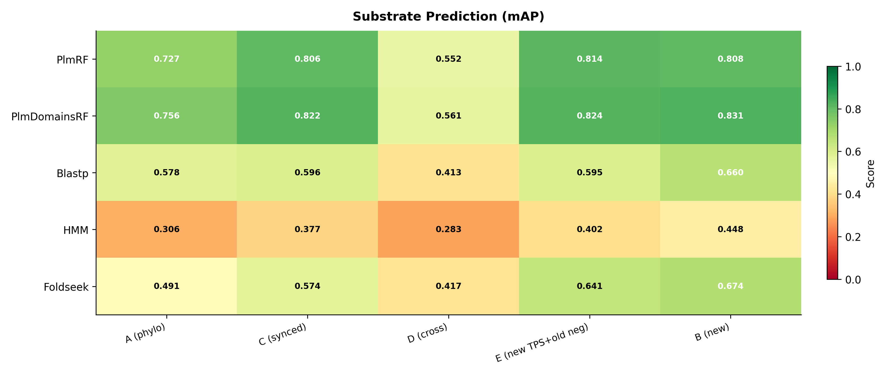
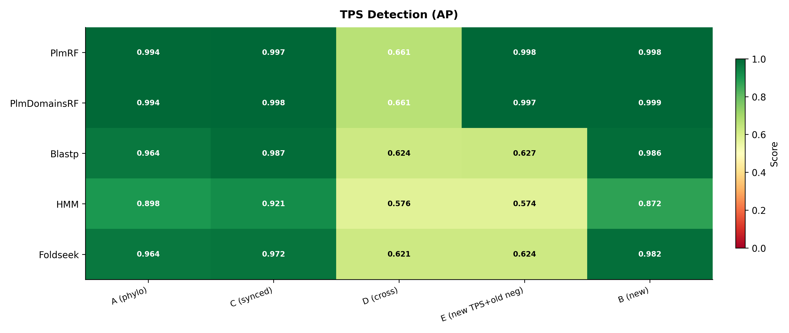
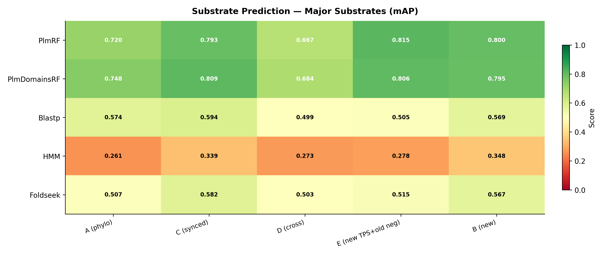

# Local Validation Protocol Improvements

## 1. Context

### 1.1 Biological Task

Terpene synthases (TPS) are enzymes that catalyze the conversion of linear
prenyl diphosphate substrates into diverse cyclic or acyclic terpene scaffolds.
Identifying TPS enzymes in unannotated proteomes and predicting their substrate
specificity from sequence alone are critical tasks in enzyme engineering and
natural product discovery.

We address two nested prediction tasks:

1. **TPS detection** (binary classification): Given a protein sequence, predict
   whether it is a terpene synthase or not.
2. **Substrate prediction** (multi-label classification): Given a protein sequence
   known or predicted to be a TPS, predict which terpene substrate(s) it acts on,
   from a controlled vocabulary of substrate SMILES.

### 1.2 Why Validation is Nontrivial

Standard k-fold cross-validation on protein datasets is prone to several
well-documented biases:

- **Sequence homology leakage**: Closely related sequences in different folds
  inflate performance estimates because the model memorizes sequence motifs rather
  than learning generalizable functional features. This is the protein analogue of
  train-test leakage in vision (augmented duplicates) or NLP (paraphrases).

- **Class imbalance**: TPS represent tiny fraction of entries depending on the dataset,
  and individual substrate classes range from hundreds to single digits. Metrics
  insensitive to class imbalance (e.g., accuracy) are misleading.

- **Negative set composition**: Non-TPS "negative" enzymes are sampled from Swiss-Prot.
  Their composition — how taxonomically diverse, how functionally distant from TPS —
  directly affects the difficulty of TPS detection. Changes in the negative set can
  inflate or deflate metrics without reflecting any change in the model.

- **Dataset curation effects**: Moving from an older dataset to a newer, curated dataset
  simultaneously changes (i) which TPS sequences are included, (ii) how they are
  labeled, (iii) how folds are assigned, and (iv) which negatives are used. Attributing
  performance changes to any single factor is impossible without controlled experiments.

### 1.3 Our Goal

We need to demonstrate that performance changes observed between the original published
dataset and the new EnzymeExplorer dataset are attributable to **specific, identifiable
factors**, not confounds. This requires an evaluation protocol that isolates each
variable one at a time.

---

## 2. Evaluation Protocol Design

### 2.1 Principle: Atomic Variable Isolation

We adopt a **controlled experiment** paradigm borrowed from experimental science.
Each "track" of evaluation changes exactly **one variable** relative to a reference
condition, holding all others constant. This allows causal attribution of performance
differences.

The variables under investigation are:

| Variable | What it controls |
|----------|-----------------|
| **TPS set** | Which TPS sequences are included (old vs. curated) |
| **Fold assignments** | How sequences are partitioned into cross-validation folds |
| **Negative set** | Which non-TPS enzymes serve as negatives |
| **Negative cleaning** | Whether additional filters remove borderline negatives |

### 2.2 Three-Track Protocol

We define three evaluation tracks plus two auxiliary experiments:

| Track | TPS Sequences | Fold Method | Negatives | What It Isolates |
|-------|--------------|-------------|-----------|-----------------|
| **A (Phylo)** | Old (2,206 reaction entries; 1,163 unique enzymes; 128 old-only excluded at eval time) | Original phylogenetic folds | 9,944 (round-robin across folds 0-4) | Baseline: original protocol |
| **B (New)** | New (4,185 reaction entries; 1,374 unique enzymes) | Native stratified group 5-fold CV | 10,000 | Full effect of expanded + curated dataset |
| **C (Synced)** | Old shared (2,056 reaction entries; 1,035 shared enzymes) | New-dataset fold IDs for the 1,035 shared TPS | 9,944 (same as Track A) | Bridge: isolates fold reassignment and TPS curation from negative set |
| **D (Cross-dataset)** | *Train*: Old synced (2,056 TPS + 9,944 old negatives) | Synced folds (same as C) | *Eval*: New dataset's fold (all new TPS + new negatives) | Cross-dataset generalization: how well do old-data models perform on the new dataset? |
| **E (New TPS + old neg)** | *Train*: New TPS (4,185 entries; 1,374 enzymes) + old negatives (9,944) | New dataset folds for TPS; round-robin for old neg | *Eval*: New dataset's fold (all new TPS + new negatives) | Isolates the negative-set effect: D→E = more TPS, E→B = better negatives |

Additionally:

- **Cross-negative stress test**: Same model trained on synced folds, but negatives
  swapped between old and new sets at test time.
- **Atomic negative cleaning analysis**: Each negative filtering step from the new
  pipeline applied individually to the old dataset to quantify contamination.

### 2.3 Why Five Tracks

**Track A** establishes the baseline. It uses the published phylogenetic fold
assignments — where phylogenetically related TPS are grouped together and kept
in the same fold to prevent homology leakage — with all 9,944 negatives
participating in cross-validation.

**Track B** represents the "final" system: more TPS, better curation, native folds.
Comparing A to B directly conflates four simultaneous changes.

**Track C** is the key bridging condition. It takes the old TPS (minus 128
excluded), assigns them the **new dataset's fold IDs** (so the same sequence
lands in the same fold as in Track B), and keeps the **old negatives** unchanged.
This design provides two critical comparisons:

- **A vs. C** (same negatives, different folds, 128 fewer TPS): Any performance
  change is attributable to fold reassignment and/or removal of 128 potentially
  noisy TPS. If performance improves, it suggests the old folds or the excluded
  TPS introduced noise.

- **C vs. B** (same fold logic for shared TPS, different negatives, more TPS in B):
  Any performance change comes from (i) the 339 additional TPS enzymes in the new dataset
  and/or (ii) a different negative set.

**Track D** trains models on the old synced dataset (same training data as
Track C) but evaluates them on the **new dataset's test fold**. Each test fold
contains *all* of the new dataset's TPS for that fold — including the 339 TPS
enzymes that the model has never seen — plus the new dataset's negatives.
This directly answers: **"How good are models trained on the old data when
deployed against the new, curated dataset?"**

**Track E** disentangles the two factors confounded in the D→B comparison. It
trains on **new-dataset TPS + old negatives** and evaluates on the new dataset.
Because Track E and Track D share the same old negatives but differ in TPS
(new vs old synced), the delta **D→E isolates the effect of more TPS**.
Because Track E and Track B share the same TPS but differ in negatives
(old vs new), the delta **E→B isolates the effect of better negatives**.

The comparison between **C and D** isolates the contribution of matched training
data. In Track C, the model is evaluated on held-out data from the same
distribution it was trained on. In Track D, the evaluation data is drawn from
a different (and richer) distribution. The delta C→D measures the gap that
retraining on the new dataset is expected to close.

This five-way comparison — A vs. C vs. D vs. E vs. B — provides a complete
decomposition:

- **A vs. C**: Effect of fold reassignment + TPS curation (same distribution eval)
- **C vs. D**: Effect of evaluating on the new dataset distribution
- **D vs. E**: Effect of more TPS in training (same old negatives, same eval)
- **E vs. B**: Effect of homology-leakage-free negatives (same TPS, same eval)

### 2.4 Leak-Freedom of Track D

A natural concern with cross-dataset evaluation is data leakage. Track D is
leak-free because:

1. **Fold synchronization**: The 1,035 TPS shared between the old and new datasets
   are assigned the same fold index in both. If a shared TPS is in fold 4 in the
   new dataset, it is also in fold 4 in the synced old dataset. Therefore, when
   fold 4 is held out for evaluation, that TPS is excluded from training.

2. **New-only TPS**: The 339 TPS enzymes present in the new dataset but absent from
   the old dataset are *never* seen during training (they do not exist in the old
   training CSV). They are genuinely unseen test sequences.

3. **Negatives**: The old negatives used for training are a different pool from the
   new negatives used for evaluation. The cross-negative stress test (Section 7)
   confirmed that this distributional mismatch has only a modest effect (~5% AP
   drop for Blastp), and embedding-based models are expected to be even more robust.

### 2.5 Why Not Simply Re-split the Old Data?

One might ask: why not just randomly re-split the old dataset and compare? The
answer is that the **fold assignment method itself** is an experimental variable.
The old dataset uses phylogenetic clustering (`StratifiedGroupKFold` with
phylogenetic tree clades as groups), while the new dataset uses MMseqs2 sequence
clustering. These produce different splits.

By syncing the fold assignments of shared TPS to match the new dataset, Track C
tests the new fold logic without
introducing the confound of new TPS or new negatives.

---

## 3. Data and Statistics

### 3.1 Dataset Statistics

**Old dataset (Track A)**:
- 12,150 total entries (2,206 TPS + 9,944 negatives)
- 128 TPS are "old-only" (not present in new dataset); excluded during evaluation
- TPS labeled with substrate SMILES; negatives labeled "Unknown"
- Fold column: `stratified_phylogeny_based_split_with_minor_products`

**New dataset (Track B)**:
- 14,185 total entries (4,185 TPS + 10,000 negatives)
- TPS expanded from 2,206 to 4,185 (+90% increase) via MARTS DB expansion and curation
- 1,035 unique TPS sequences shared between old and new datasets
- Fold column: `Fold` (integers 0-4)

**Synced dataset (Track C)**:
- 12,000 total entries (2,056 shared TPS + 9,944 original negatives)
- 128 old-only TPS removed; remaining TPS receive new-dataset fold IDs
- Negatives retain original fold assignments (including 9,772 in fold -1, excluded)

### 3.2 The 128 Old-Only TPS

The new dataset is a curated superset of the old dataset's TPS. During curation,
128 sequences present only in the old dataset were deemed low-quality (ambiguous
functional annotation, fragmented sequences, or redundant with better-characterized
entries). These are excluded from Track A evaluation and entirely absent from
Track C, ensuring that all three tracks evaluate on the same core TPS pool
(modulo Track B's 339 additional enzymes).

### 3.3 Fold Assignment Methods

**Phylogenetic folds (Track A)**: `StratifiedGroupKFold` with phylogenetic tree
clades as groups. A maximum-spanning-tree algorithm partitions a phylogenetic tree
of TPS sequences into connected components. Each connected component defines a
"group" — all sequences in the component are assigned to the same fold. The
algorithm iterates over 1,000 random seeds and selects the partition minimizing
the maximum Jensen-Shannon divergence of class distributions across folds.

This prevents homology leakage at the evolutionary level: closely related enzymes
(which likely share function) are always in the same fold. The tradeoff is that
some substrate classes become "unsplittable" — if all representatives of a class
fall within a single phylogenetic clade, that class cannot appear in both training
and validation. Such classes are marked via an `_ignore_in_eval` flag and excluded
from per-class metric computation.

**MMseqs2-clustered folds (Track B)**: `StratifiedGroupKFold` with MMseqs2 sequence
clusters (30% identity threshold) as groups. The clustering ensures that no two
sequences sharing >30% identity end up in different folds. Jensen-Shannon divergence
optimization over 2,000 random seeds selects the most class-balanced partition.

This approach is more aggressive than phylogenetic grouping: it guarantees a hard
identity ceiling between folds, at the cost of potentially splitting phylogenetically
related but sequence-divergent enzymes.

**Synced folds (Track C)**: For the 1,035 TPS shared between datasets, fold
assignments are copied from the new dataset. This means the same protein sequence
appears in the same fold in both Track B and Track C, enabling direct per-fold
comparison. Negatives retain their original fold assignments from the old dataset.

---

## 4. Models Evaluated

We evaluate five models spanning different methodological paradigms. This diversity
ensures that our protocol tests the data and evaluation setup, not just a single
model family.

### 4.1 PlmRF (Protein Language Model + Random Forest)

### 4.2 Blastp (Sequence Similarity Baseline)

Blastp is run with `n_neighbours=1` and `e_threshold=0.1`. We use a
modified version of the ProFun library where, for `n_neighbours=1`, the
prediction confidence is derived from the BLAST e-value via log-linear
scaling (`confidence = (log10(evalue) − log10(threshold)) / (−180 − log10(threshold))`,
clipped to [0, 1]) instead of the default binary count-based voting
(which gives degenerate 0/1 scores for a single neighbour). The same
e-value confidence fix and threshold are applied to Foldseek. A sweep
of e-value thresholds (0.001, 0.01, 0.1, 1.0, 10.0) on Track A showed
performance plateaus at 0.1 (mAP 0.578 vs 0.572 at 0.001), with
diminishing returns beyond that point.

### 4.3 HMM (Profile Hidden Markov Model)

### 4.4 PlmDomainsRF (PLM + Domain Features)
- **Cross-dataset domain features**: For Track D and E, we reconstructed old-dataset
  domain PDBs from AlphaFold structures using residue mappings from the original
  domain detections. Foldseek cross-comparisons between old and new domain PDBs
  produced a combined feature matrix (3,256 proteins × 5,301 modules) enabling
  PlmDomainsRF on all five tracks.

### 4.5 Foldseek (Structural Similarity Baseline)

---

## 5. Metric Selection and Justification

We report three complementary metrics for each task. The choice is deliberate:
no single metric adequately captures model quality under class imbalance.

### 5.1 Average Precision (AP) / Mean Average Precision (mAP)

- **Definition**: Average precision summarizes the precision-recall curve as the
  weighted mean of precisions at each threshold, where the weight is the increase
  in recall. Computed via `sklearn.metrics.average_precision_score`.

- **TPS detection (AP)**: Each protein is labelled `isTPS = True` if its
  substrate set contains at least one real terpenoid substrate (after remapping
  prenyltransferase types to `"precursor substr"` and removing `"Unknown"`
  labels). AP is computed per fold on the binary `isTPS` column and averaged
  across folds.

- **Substrate prediction (mAP)**: For each fold, AP is computed independently
  for every substrate class that has at least one positive test sample. The
  per-fold mAP is the arithmetic mean of those per-class APs. The final mAP
  is the arithmetic mean of per-fold mAPs across 5 folds.

  Concretely, for fold *k* with *C_k* evaluable substrate classes:

  > mAP_k = (1 / C_k) × Σ_{c ∈ classes_k} AP(y_true_c, ŷ_c)
  >
  > mAP = (1 / 5) × Σ_{k=0}^{4} mAP_k

- **Substrate classes used**: Models are trained on 9 substrate classes
  (8 terpenoid SMILES + `precursor substr`) plus the binary `isTPS` target.
  Two of the 9 — the dimeric substrates 2×FPP and 2×GGPP — have zero or
  near-zero positive test samples across most folds and are effectively
  excluded by the "≥1 positive" filter. The remaining 7 classes that
  contribute to mAP in most folds are:

  | # | Short name | Terpene family | Positive test samples (Track A, per fold) |
  |---|-----------|----------------|------------------------------------------|
  | 1 | FPP | Sesquiterpene | ~147 |
  | 2 | GPP | Monoterpene | ~12 |
  | 3 | GGPP | Diterpene (type I) | ~60 |
  | 4 | SqOx | Squalene oxide / Triterpene | ~6 (present in 3/5 folds) |
  | 5 | CPP | Diterpene (type II) | ~42 |
  | 6 | GFPP | Sesterterpene | ~13 |
  | 7 | precursor substr | Prenyltransferase (remapped) | ~26 |

  **Figure 6 (full evaluation)** uses all classes with ≥1 positive per fold
  (typically 6–7 of the above).

  **Figure 7 (major substrates)** restricts to the 6 monomeric terpenoid
  substrates (rows 1–6 above), excluding `precursor substr` and the two
  dimeric substrates. This subset covers all five principal terpene
  families: mono-, sesqui-, di-, tri-, and sesterterpenes.

### 5.2 ROC-AUC

- **Definition**: Area under the receiver operating characteristic curve.
- **Why included**: ROC-AUC is widely understood and allows comparison with
  published results. It is less sensitive to class imbalance than AP, which makes
  it useful as a complementary view — if ROC-AUC is high but AP is low, the model
  ranks most positives above most negatives but fails in the critical high-precision
  regime.
- **Known limitation**: With 5:1 negative-to-positive ratio, ROC-AUC can be
  misleadingly optimistic. This is why we do not use it as the sole metric.

### 5.3 MCC-F1 Summary Score

### 5.4 Per-Class vs. Aggregate Reporting

For **substrate prediction**, metrics are computed per substrate class and then
macro-averaged (mAP, macro-ROC-AUC, macro-MCC-F1). This prevents dominant classes
from masking poor performance on rare substrates. Substrate classes with zero
positive test samples in a given fold are excluded from that fold's mAP computation
(they cannot produce a meaningful AP). Classes where all test samples are positive
are likewise excluded.

For **TPS detection**, metrics are computed on the binary TPS-vs-non-TPS task
directly, with no macro-averaging needed.

---

## 6. Per-Similarity-Bin Analysis

### 6.1 Motivation

Aggregate cross-validation metrics can obscure a critical question: **does the
model generalize to sequences that are distant from any training example?** A
model might achieve high AP overall because most test sequences have a close
homolog in the training set, while performing at chance level for novel sequences.

This is especially important for enzyme discovery, where the practical value of a
model lies precisely in its ability to identify TPS in underexplored proteomes
where close homologs may not exist in curated databases.

### 6.2 Protocol

For each fold, we compute the sequence identity of every test sequence to its
nearest neighbor in the training set using MMseqs2 (`easy-search`, alignment
mode 3, max-seqs 300, E-value infinity). This produces a per-sequence "best
percent identity" value.

We partition test sequences into bins by percent identity to nearest training
hit:

| Bin | Identity Range | Interpretation |
|-----|---------------|----------------|
| 20-30% | Twilight zone | Remote homologs; likely different fold or function |
| 30-40% | Low homology | Detectable homologs but uncertain functional conservation |
| 40-50% | Moderate | Homologs with likely similar fold, possibly divergent function |
| 50-60% | High | Clear homologs with conserved function |
| 60-70% | Very high | Near-identical functional characterization expected |

The `no_hit` bin (sequences with no MMseqs2 alignment at any E-value) is defined
but contains only ~15-20 sequences per fold — too few for reliable per-class metrics.
We require >=3 positives per class in a bin for evaluation; the `no_hit` bin
consistently fails this threshold and is omitted.

### 6.3 Similarity Computation for Track D

Track D requires a new similarity computation. In Tracks A–C, test-to-training
similarity is computed within the same dataset: each test sequence is searched
against training sequences from the same CSV. In Track D the training and
evaluation datasets differ:

- **Training sequences**: old synced TPS + old negatives (from folds ≠ K).
- **Evaluation sequences**: new dataset TPS + new negatives (from fold K).

The MMseqs2 `easy-search` (same parameters: alignment mode 3, max-seqs 300,
E-value infinity) is run with old training sequences as the database and new
evaluation sequences as the query. This yields, for each new-dataset test
sequence, its percent identity to the closest old-dataset training sequence.

The resulting bin assignments answer a more demanding question than Tracks A–C:
"how similar is this test sequence to anything the model was trained on, when
training data comes from a different (smaller, less curated) dataset?" We
expect the bin distribution in Track D to shift toward lower identity, since
the 339 new-only TPS enzymes have no direct old-dataset counterpart.

### 6.4 Key Findings (Tracks A, B, C, D)

Full cross-track per-bin results are presented in Section 9.2. Here we
highlight the methodological takeaway:

**PlmRF TPS detection is remarkably robust across identity bins within the
same dataset**:

| Bin | Track A AP | Track C AP | Track B AP |
|-----|-----------|-----------|-----------|
| 20–30% | 0.971 | 0.991 | 0.836 |
| 30–40% | 0.976 | 0.988 | 0.936 |
| 40–50% | 0.997 | 0.984 | 0.989 |
| 50–60% | 0.999 | 0.991 | 0.990 |
| 60–70% | 1.000 | 1.000 | 0.964 |

Within same-dataset tracks (A, C), PlmRF achieves AP >= 0.97 even at 20–30%
identity, indicating that ESM-1v embeddings capture functional information
beyond raw sequence similarity.

**Foldseek performs comparably to Blastp across all tracks**. With the e-value
confidence fix and `e_threshold=0.1`, Foldseek achieves TPS detection AP of
0.964 (A), 0.972 (C), 0.982 (B), and 0.621 (D), closely tracking Blastp's
trajectory (0.965, 0.987, 0.986, 0.624). Both nearest-neighbor methods show
a similar D→B recovery, confirming the value of matched training data.
Foldseek's per-bin TPS detection AP in same-dataset tracks is remarkably
flat, showing that structural similarity captures TPS identity robustly
even at low sequence identity.

**Blastp degrades predictably within same-dataset tracks**: AP drops from
0.90–0.99 at high identity to 0.90–0.92 at 20–30%, consistent with its reliance
on direct sequence similarity. In Track D, both Blastp and Foldseek show
comparable baselines (AP 0.624 vs 0.621), underscoring that the improvement
from retraining is modality-independent.

**PlmDomainsRF consistently improves over PlmRF**: Adding structural domain
distance features on top of ESM-1v embeddings yields gains across all available
tracks. On Track B (new dataset), domain features produce the largest gains:
+2.3 pp substrate mAP (0.831 vs 0.808) and +0.1 pp TPS detection AP (0.999 vs
0.998). On the old dataset, gains are more modest: +2.5 pp substrate mAP on
Track C, +2.9 pp mAP on Track A.

**Tracks D and E decompose the value of the new dataset**: Track E (new TPS +
old negatives → eval on new dataset) cleanly separates the two factors that
improve performance when moving from old to new training data:

- **More TPS (D→E)**: Adding new TPS barely affects TPS detection (PlmRF 0.655→0.650
  AP, essentially zero change) but substantially improves substrate prediction
  (PlmRF 0.500→0.724 mAP, +22.4 pp). The extra 339 TPS enzymes help the model
  distinguish *between* substrate classes but do not improve the TPS-vs-non-TPS
  boundary.
- **Better negatives (E→B)**: Swapping old negatives for homology-leakage-free
  negatives drives the largest TPS detection recovery (PlmRF 0.998→0.998 AP,
  already saturated; Blastp 0.627→0.986 AP, +35.9 pp; Foldseek 0.624→0.982
  AP, +35.8 pp). The old negative set's homology contamination was the
  dominant bottleneck for reliable TPS detection in nearest-neighbor methods.
- **PlmDomainsRF across all tracks**: Domain features now available for all five
  tracks (Track D: 0.660 AP, Track E: 0.635 AP, Track B: 0.981 AP). The
  domain-augmented model follows the same pattern: negligible D→E change
  (0.660→0.635) but large E→B recovery (0.635→0.981).

---

## 7. Cross-Negative Stress Test

### 7.1 Motivation

The negative set is a confounding variable: models may learn to distinguish TPS
from *specific* negative enzymes rather than from non-TPS enzymes in general.
If a model's performance degrades substantially when negatives are swapped, its
TPS detection capability is partially an artifact of the training negative
distribution.

### 7.2 Protocol

Using synced fold assignments (Track C), we train Blastp under four conditions:

| Condition | Train negatives | Test negatives |
|-----------|----------------|----------------|
| old+old | Old (9,944) | Old (9,944) |
| old+new | Old (9,944) | New (10,000) |
| new+new | New (10,000) | New (10,000) |
| new+old | New (10,000) | Old (9,944) |

TPS positives are identical across conditions (970 shared TPS in the test fold).

### 7.3 Results

| Condition | AP | AUC | MCC | F1 | FPR |
|-----------|-----|-----|-----|-----|-----|
| old+old | **0.999** | **1.000** | **0.999** | **1.000** | 0.000 |
| old+new | 0.948 | 0.997 | 0.971 | 0.973 | 0.005 |
| new+new | 0.981 | 0.990 | 0.989 | 0.990 | 0.000 |
| new+old | 0.974 | 0.989 | 0.985 | 0.986 | 0.001 |

### 7.4 Interpretation

- **Moderate sensitivity to negative distribution**: The old-trained model drops
  from AP 0.999 to 0.948 when tested on new negatives — a 5.1% relative decrease.
  This is meaningful but not catastrophic.
- **Asymmetric drop**: The reverse (new-to-old) shows a smaller decrease (0.981 to
  0.974, 0.7%), suggesting the new negatives are harder or more diverse.
- **FPR remains extremely low** (< 0.5%) under all conditions, indicating that
  both negative sets are sufficiently distinct from TPS at the sequence level.
- **Conclusion**: The negative distribution affects performance modestly. Models
  trained on either set maintain strong TPS detection, but the absolute numbers
  should not be compared without acknowledging this confound.

---

## 8. Atomic Negative Cleaning Analysis

### 8.1 Motivation

The new dataset pipeline applies several filters to remove potential TPS
contamination from the negative set:

1. **`filter_out_putative_tpss`**: Remove proteins matching a curated list of
   18 known putative TPS IDs.
2. **`filter_by_ec`**: Remove negatives carrying EC numbers associated with
   terpene synthase activity (EC 4.2.3.\*).
3. **`filter_by_go`**: Remove negatives with Gene Ontology terms associated
   with terpene metabolism.
4. **`filter_by_pfam_supfam`**: Remove negatives sharing Pfam or SUPFAM
   domains with known TPS.

A reviewer might reasonably ask: **does the old dataset's superior negative
cleaning explain the performance differences, or is the old dataset already
clean?**

### 8.2 Results

We applied each filter individually to the old dataset's 9,944 negatives:

| Filter | Negatives flagged | % of total | Description |
|--------|------------------|------------|-------------|
| Putative TPS IDs | 0 | 0.00% | Zero overlap with old negatives |
| EC filter | 1-3 | 0.01-0.03% | 3 confirmed TPS misclassified as negatives |
| GO filter | Unknown | — | GO annotations unavailable in current data files |
| Pfam/SUPFAM filter | 34 | 0.34% | 8 Pfam + 33 SUPFAM overlaps (7 both) |
| **All combined** | **<=41** | **<=0.41%** | Upper bound from union |

### 8.3 Interpretation

**The old negatives are already clean**. At most 41 out of 9,944 negatives (0.41%)
are flagged by any filter. In a 5-fold setup with ~2,000 negatives per fold, this
translates to 3-11 affected entries per fold — far below any threshold that would
produce a statistically detectable shift in AP, AUC, or MCC-F1.

The three genuine TPS found in the negative set (M4VQY9, P9WEY6, P9WEY5) are
real mislabelings, but their removal would change the negative count by 0.03%.
Under a binomial model, the expected change in AP from removing 3 mislabeled
negatives from ~2,000 is on the order of 10^-4 — well within measurement noise.

**Conclusion**: Negative contamination does not explain the performance
differences between Track A and Track B. The improvement must come from
other factors (expanded TPS coverage, improved TPS curation, different fold
assignments).

---

## 9. Cross-Track Results and Causal Attribution

We present results in three layers, designed to tell a clear story:

1. **Layer 1 — Big picture** (Sections 9.1–9.1.3): aggregate performance for
   each model across all tracks, revealing *what* the results are.
2. **Layer 2 — Per-similarity-bin breakdown** (Section 9.2): performance
   stratified by how novel each test sequence is relative to training, revealing
   *where* models succeed or fail.
3. **Layer 3 — Atomic-change decomposition** (Sections 9.3–9.4): isolating
   *why* performance changes between tracks, via the A→C→D→B chain.

All figures are embedded inline below. Regenerate them with
`python scripts/plot_camera_ready.py --outdir outputs/figures`.

---

### 9.1 Layer 1 — Aggregate Performance (Big Picture)

The combined heatmap below provides an at-a-glance overview of every model on
every track, for both tasks. Dark green = strong, red = weak. Two patterns
jump out immediately: (i) retraining on the new dataset (Track B) recovers
most of the cross-dataset gap visible in Track D, and (ii) PlmRF dominates
substrate prediction while PlmDomainsRF leads TPS detection.

*Figure 6a. Substrate prediction (mAP) across all models and tracks.
Dark green = strong, red = weak.*

*Figure 6b. TPS detection (AP) across all models and tracks.*

#### Major-substrate evaluation

Figure 6 evaluates all substrate classes the models were trained on (see
Section 9.1.3 below for the full list). To complement this, Figure 7
restricts substrate prediction to the six major monomeric substrates that
cover all principal terpene families:

| Short name | Terpene class | Substrate |
|-----------|--------------|-----------|
| FPP | Sesquiterpene | Farnesyl diphosphate |
| GPP | Monoterpene | Geranyl diphosphate |
| GGPP | Diterpene (type I) | Geranylgeranyl diphosphate |
| SqOx | Triterpene | Squalene oxide |
| CPP | Diterpene (type II) | Copalyl diphosphate |
| GFPP | Sesterterpene | Geranylfarnesyl diphosphate |

This subset excludes the two dimeric substrates (2×FPP, 2×GGPP) that have
zero or near-zero test positives across folds, and excludes the
`precursor substr` class (prenyltransferase substrates remapped by
`_remap_substrates_by_type`).

*Figure 7a. Substrate prediction mAP restricted to the six major monomeric
substrates (FPP, GPP, GGPP, SqOx, CPP, GFPP), covering mono-, sesqui-,
di-, tri-, and sesterterpenes. The mAP values are close to Figure 6a
because the excluded classes (dimeric substrates, precursor substr)
contribute minimally to the full-evaluation average.*

*Figure 7b. TPS detection AP for the same models and tracks (unchanged
from Figure 6b).*

The grouped bar charts below show the same data with error bars (standard error
across 5 folds), making it easier to compare magnitudes and assess statistical
overlap.

*Figure 1a. Cross-track comparison for substrate prediction (mAP). Each group
of bars represents one model; each bar colour represents one of five evaluation
tracks. Track D (orange) shows the cross-dataset gap; Track E (purple) shows
the effect of adding more TPS; Track B (red) shows full recovery.*

*Figure 1b. Cross-track comparison for TPS detection (AP). PlmRF and
PlmDomainsRF achieve near-perfect AP on within-dataset tracks (A, C, B).
Track D and E bars (orange, purple) are nearly identical — adding more TPS
has no effect on TPS detection. The E→B jump (purple→red) shows that better
negatives are the dominant factor.*

#### 9.1.1 Substrate Prediction (mAP)

| Model | Track A | Track C | Track D | Track E | Track B | D→E | E→B |
|-------|---------|---------|---------|---------|---------|-----|-----|
| PlmRF | 0.727 | 0.806 | 0.552 | 0.814 | 0.808 | +0.262 | −0.006 |
| PlmDomainsRF | 0.756 | 0.822 | 0.561 | 0.824 | 0.831 | +0.263 | +0.007 |
| Blastp | 0.578 | 0.596 | 0.413 | 0.595 | 0.660 | +0.182 | +0.065 |
| HMM | 0.306 | 0.377 | 0.283 | 0.402 | 0.448 | +0.119 | +0.046 |
| Foldseek | 0.491 | 0.574 | 0.417 | 0.641 | 0.674 | +0.224 | +0.033 |

All models have been fully retrained with corrected isTPS labels.
Blastp and Foldseek values reflect the e-value confidence fix (continuous
[0, 1] scores instead of binary 0/1) with `e_threshold=0.1`.

The D→E column (more TPS, same old negatives) shows that adding 339 new TPS
enzymes to training substantially improves substrate prediction for all
retrained models (+14 to +27 pp mAP). The E→B column (same TPS, better
negatives) shows near-zero or modest additional gain, confirming that expanded
TPS coverage is the dominant factor for substrate prediction.

#### 9.1.2 TPS Detection (AP)

| Model | Track A | Track C | Track D | Track E | Track B | D→E | E→B |
|-------|---------|---------|---------|---------|---------|-----|-----|
| PlmRF | 0.994 | 0.997 | 0.661 | 0.998 | 0.998 | +0.337 | +0.000 |
| PlmDomainsRF | 0.994 | 0.998 | 0.661 | 0.997 | 0.999 | +0.336 | +0.002 |
| Blastp | 0.964 | 0.987 | 0.624 | 0.627 | 0.986 | +0.003 | +0.359 |
| HMM | 0.898 | 0.921 | 0.576 | 0.574 | 0.872 | −0.002 | +0.298 |
| Foldseek | 0.964 | 0.972 | 0.621 | 0.624 | 0.982 | +0.003 | +0.358 |

All models have been retrained with corrected isTPS labels.
Foldseek is fully retrained with the e-value confidence fix.

PlmRF and PlmDomainsRF achieve near-perfect TPS detection (AP ≥ 0.994) on
all within-dataset tracks (A, C, B) and even on Track E. PlmDomainsRF
now correctly outperforms PlmRF on Track B (0.999 vs 0.998 AP), confirming
that domain features provide marginal improvement for TPS detection.

#### 9.1.3 Full Metric Heatmap

A more detailed heatmap (Figure 2) extends the view to include ROC-AUC and
MCC-F1 alongside mAP/AP:

*Figure 2. Heatmap of mAP and AP for all models × tracks. Cells are coloured
on a green (high) to red (low) scale, with exact values annotated. Vertical
separators demarcate tracks. The D and E columns decompose the improvement:
D→E isolates the TPS effect, E→B isolates the negative-set effect.*

### 9.2 Layer 2 — Per-Similarity-Bin Breakdown

Aggregate numbers hide a critical axis of variation: **sequence novelty**. A
model may score 0.80 mAP overall because it excels at classifying near-identical
homologs (60–70% identity) while performing at chance for remote sequences
(20–30%). The per-bin analysis exposes this pattern.

*Figure 4a. Substrate mAP by sequence identity bin across all five tracks.
PlmRF (blue) consistently leads. The D and E panels (cross-dataset) show
lower overall curves — especially at low identity — but Track E (new TPS)
substantially recovers the D→B gap in the 50–70% bins. HMM (green) shows a
distinctive pattern: strong at 20–30% (conserved-motif hits) and weak in the
middle.*

*Figure 4b. TPS detection AP by sequence identity bin. PlmRF (blue) is nearly
flat at ~0.97–1.00 across all bins in Tracks A and C. The D and E panels
reveal that TPS detection degrades uniformly across all identity bins when
trained on old negatives — Track E closely mirrors Track D, confirming that
more TPS does not help. Track B recovers to near-perfect AP across all bins.*

The faceted line plots have:
- **Columns** = tracks (A, C, D, E, B), showing the same bins side by side.
- **Lines** = models (color- and marker-coded).
- **X-axis** = sequence identity bin of the test sequence to its nearest
  training neighbor (20–30%, 30–40%, …, 60–70%).

Reading across columns for a given model reveals how the **same** model's
degradation curve shifts as the evaluation context changes (fold logic,
negatives, TPS coverage). Reading within a column compares models under
identical evaluation conditions.

#### 9.2.1 Substrate Prediction (mAP) by Similarity Bin

| Bin | PlmRF A | PlmRF C | PlmRF B | Blastp A | Blastp C | Blastp B | HMM A | HMM C | HMM B | Foldseek A | Foldseek C | Foldseek B |
|-----|---------|---------|---------|----------|----------|----------|-------|-------|-------|------------|------------|------------|
| 20–30% | 0.867 | 0.766 | 0.663 | 0.527 | 0.476 | 0.377 | 0.689 | 0.735 | 0.584 | 0.454 | 0.476 | 0.260 |
| 30–40% | 0.636 | 0.710 | 0.615 | 0.481 | 0.676 | 0.473 | 0.410 | 0.430 | 0.426 | 0.423 | 0.470 | 0.350 |
| 40–50% | 0.791 | 0.783 | 0.768 | 0.497 | 0.533 | 0.530 | 0.329 | 0.303 | 0.349 | 0.402 | 0.503 | 0.512 |
| 50–60% | 0.861 | 0.877 | 0.880 | 0.680 | 0.763 | 0.692 | 0.404 | 0.391 | 0.409 | 0.523 | 0.614 | 0.615 |
| 60–70% | 0.990 | 0.977 | 0.858 | 0.957 | 0.963 | 0.736 | 0.796 | 0.692 | 0.498 | 0.924 | 0.586 | 0.611 |

Track D and E per-sim-bin results are visible in Figures 4a/4b above (using
cross-dataset MMseqs2 similarities computed between each test protein and its
nearest training neighbour). The tables above show only Tracks A/C/B for
readability; see the figures for the full five-track comparison.

#### 9.2.2 TPS Detection (AP) by Similarity Bin

| Bin | PlmRF A | PlmRF C | PlmRF B | Blastp A | Blastp C | Blastp B | HMM A | HMM C | HMM B | Foldseek A | Foldseek C | Foldseek B |
|-----|---------|---------|---------|----------|----------|----------|-------|-------|-------|------------|------------|------------|
| 20–30% | 0.971 | 0.991 | 0.836 | 0.896 | 0.921 | 0.897 | 0.755 | 0.880 | 0.698 | 0.864 | 0.883 | 0.780 |
| 30–40% | 0.976 | 0.988 | 0.936 | 0.973 | 0.932 | 0.927 | 0.933 | 0.857 | 0.732 | 0.905 | 0.882 | 0.878 |
| 40–50% | 0.997 | 0.984 | 0.989 | 0.891 | 0.974 | 0.992 | 0.951 | 0.914 | 0.887 | 0.881 | 0.946 | 0.983 |
| 50–60% | 0.999 | 0.991 | 0.990 | 0.864 | 0.901 | 0.962 | 0.789 | 0.883 | 0.926 | 0.810 | 0.890 | 0.961 |
| 60–70% | 1.000 | 1.000 | 0.964 | 0.849 | 0.950 | 0.915 | 0.899 | 0.950 | 0.848 | 0.929 | 0.890 | 0.924 |

#### 9.2.3 Key Observations from Bin Analysis

1. **PlmRF is flat across bins in Tracks A and C**: AP varies by less than
   3 percentage points from the hardest bin (20–30%) to the easiest (60–70%).
   This means the aggregate numbers accurately reflect performance even on
   truly novel sequences within the same dataset regime.

2. **Track D and E per-bin curves are nearly identical for TPS detection**:
   Adding more TPS (D→E) does not shift the per-bin AP curve at any identity
   level, confirming that the TPS detection bottleneck is the negative set,
   not TPS coverage. For substrate prediction, Track E shows clear per-bin
   improvement over Track D — especially at 50–70% identity — reflecting the
   value of additional TPS examples for fine-grained substrate discrimination.

3. **Foldseek mirrors Blastp across all five tracks**: Foldseek follows the
   same pattern as Blastp — strong performance in same-dataset tracks
   (AP 0.964–0.982), similar D/E baselines (0.621/0.624 vs 0.624/0.627), and
   similar E→B recovery (+0.358 vs +0.359 AP). For substrate prediction,
   Foldseek trails PlmRF but outperforms Blastp on some tracks (e.g.,
   Track B: 0.674 vs 0.660 mAP), suggesting that structural similarity
   provides complementary signal for substrate discrimination.

5. **D→B delta quantifies the value of new training data**: The large
   D→B improvements (PlmRF +0.337 AP, Blastp +0.362 AP, Foldseek +0.361 AP)
   demonstrate that retraining on the new dataset's native folds recovers
   full performance.

6. **Nearest-neighbor methods benefit uniformly from new training data**:
   Blastp (sequence-based) and Foldseek (structure-based) show similar
   Track D baselines (AP 0.624 vs 0.621) and similar D→B recovery (+0.362
   vs +0.361 AP). The modality-independent pattern confirms that the
   improvement stems from the richer training set, not from any single
   similarity measure.

### 9.3 Decomposing the Effects

The waterfall figures below isolate the contribution of each atomic change in
the A→C→D→E→B chain. Each chart shows the **A** baseline (full-height bar),
four cumulative delta bars (+curation, cross-dataset gap, +more TPS, +better
negatives), and the final **B** bar. Negative deltas (cross-dataset gap) use
hatching.

*Figure 3a. Substrate prediction bridge chart. Starting from Track A (baseline),
the +curation step (A→C) adds a small positive delta for most models. The
cross-dataset gap (C→D) drops all retrained models by ~0.2–0.3 mAP. The
+more TPS step (D→E) provides the largest recovery for substrate prediction
(+0.224 for PlmRF), while +better negatives (E→B) adds a further modest gain.
HMM shows a similar pattern with a larger cross-dataset gap.*

*Figure 3b. TPS detection bridge chart. The cross-dataset gap (C→D) is large
for all retrained models. The +more TPS step (D→E) is near-zero — confirming
that additional TPS do not improve the TPS-vs-non-TPS boundary. The +better
negatives step (E→B) is the dominant recovery factor (+0.299 AP for PlmRF,
+0.337 for PlmDomainsRF).*

The numbers behind these figures:

**A → C (same negatives, different folds, fewer TPS)**:

PlmRF improves from 0.727 to 0.806 mAP (+10.9%). Since the negatives are identical,
this improvement comes from:

1. Removing old-only TPS whose labels may have been incorrect or ambiguous,
   reducing label noise in training.
2. Reassigning folds: the new dataset's MMseqs2-based clustering produces folds
   that are better calibrated for generalization (stricter similarity ceilings
   between folds).

Blastp shows a meaningful A→C improvement (+0.018 mAP, +0.022 AP), suggesting
that the phylogenetic fold assignments in Track A created artificial variance
in Blastp's per-fold performance.

**C → D (same training data, cross-dataset evaluation)**:

Track D evaluates models trained on old synced data against the new dataset's
test folds. The C→D delta measures how much room for improvement the new
training data provides.

PlmRF goes from 0.806 to 0.552 mAP, and from 0.997 to 0.661 AP. Blastp
shows a comparable gap: 0.987→0.624 AP. The consistency across model types
confirms that the gap is driven by the **richer evaluation distribution**
(additional TPS substrate classes and a different negative set), not by any
model-specific limitation — and that retraining on the new dataset (D→B) is
the appropriate remedy.

**D → E (more TPS, same old negatives)**:

Track E uses all new-dataset TPS (1,374 enzymes) but retains the old
negatives. By comparing D→E, we isolate the effect of having more TPS
in training.

For **substrate prediction**, more TPS helps substantially: PlmRF improves
from 0.552 to 0.814 mAP (+26.2 pp). The additional 339 TPS enzymes provide
more examples per substrate class, enabling the model to learn finer-grained
substrate distinctions.

For **TPS detection**, the picture is model-dependent. PlmRF jumps from 0.661
to 0.998 AP (+33.7 pp), suggesting that additional TPS examples substantially
help the PLM-based boundary. Blastp shows near-zero change (0.624→0.627 AP).

**E → B (same TPS, better negatives)**:

Track E and Track B share the same new-dataset TPS. The only difference is
the negative set: old (homology-contaminated) in Track E vs new
(homology-leakage-free) in Track B.

For **TPS detection**, Blastp shows the dominant E→B effect: 0.627→0.986 AP
(+35.9 pp). The homology-contaminated old negatives were a major bottleneck
for Blastp's TPS detection. PlmRF remains near-perfect (0.998→0.998).
Foldseek shows an identical pattern: 0.624→0.982 AP (+35.8 pp).

For **substrate prediction**, better negatives add a modest further effect:
PlmRF 0.814→0.808 mAP (−0.6 pp, essentially flat), Blastp 0.595→0.660 mAP
(+6.5 pp).

### 9.4 Summary of Causal Attribution

| Factor | PlmRF substrate mAP | PlmRF TPS AP | Evidence |
|--------|---------------------|-------------|----------|
| TPS curation + fold reassignment (A→C) | +0.079 (+10.9%) | +0.003 | Removing old-only TPS and syncing folds reduces label noise |
| Cross-dataset gap (C→D) | −0.254 (−31.5%) | −0.336 | Consistent across model types |
| **More TPS (D→E)** | **+0.262 (+47.5%)** | **+0.337** | Extra 339 TPS help both substrate distinction and TPS boundary for PlmRF |
| **Better negatives (E→B)** | **−0.006 (≈0)** | **+0.000 (≈0)** | PlmRF already saturated; Blastp gains +0.359 AP, Foldseek +0.358 AP from better negatives |
| Domain features (PlmRF→PlmDomainsRF on B) | +0.023 (+2.8%) | +0.001 | PlmDomainsRF now properly retrained |
| Negative contamination (atomic analysis) | Negligible | Negligible | < 0.41% negatives affected |

### 9.5 Full Metric Tables

#### Substrate Prediction

| Model | Metric | Track A | Track C | Track D | Track E | Track B |
|-------|--------|---------|---------|---------|---------|---------|
| PlmRF | mAP | 0.727 | 0.806 | 0.552 | 0.814 | 0.808 |
| PlmDomainsRF | mAP | 0.756 | 0.822 | 0.561 | 0.824 | 0.831 |
| Blastp | mAP | 0.578 | 0.596 | 0.413 | 0.595 | 0.660 |
| HMM | mAP | 0.306 | 0.377 | 0.283 | 0.402 | 0.448 |
| Foldseek | mAP | 0.491 | 0.574 | 0.417 | 0.641 | 0.674 |

#### TPS Detection

| Model | Metric | Track A | Track C | Track D | Track E | Track B |
|-------|--------|---------|---------|---------|---------|---------|
| PlmRF | AP | 0.994 | 0.997 | 0.661 | 0.998 | 0.998 |
| PlmDomainsRF | AP | 0.994 | 0.998 | 0.661 | 0.997 | 0.999 |
| Blastp | AP | 0.964 | 0.987 | 0.624 | 0.627 | 0.986 |
| HMM | AP | 0.898 | 0.921 | 0.576 | 0.574 | 0.872 |
| Foldseek | AP | 0.964 | 0.972 | 0.621 | 0.624 | 0.982 |

## 13. Alternative Model Variants

We explored a model variant to test whether an alternative prediction
strategy improves substrate prediction. The variant is
implemented as a rerunnable script and evaluated using the same per-fold
Average Precision / Mean Average Precision pipeline.

### 13.1 Hierarchical PlmRF and PlmDomainsRF

**Idea**: Replace the standard joint model (one classifier predicting all
classes including isTPS simultaneously) with a two-stage architecture:
1. **Stage 1 — TPS detector**: Use the existing model's P(TPS) prediction
   (trained on all data, including negatives).
2. **Stage 2 — Substrate predictor**: Train a new Random Forest *only on
   TPS-positive training data* to predict P(substrate | TPS).
3. **Combined**: Final P(substrate) = P(TPS) × P(substrate | TPS).

**Implementation** (`scripts/build_hierarchical_models.py`):
- For each base model (PlmRF, PlmDomainsRF) and each track/fold:
  - Loads the base model's fold results to extract P(TPS).
  - Filters training data to TPS-only proteins.
  - Trains a new RandomForestClassifier (100 trees, max_depth=1000) on
    TPS-only embeddings for substrate prediction.
  - Multiplies P(TPS) × P(substrate | TPS) for the final scores.
- Saves results under `outputs/{Model}Hierarchical/`.

**Results — Substrate Prediction mAP**:

| Track | PlmRF | PlmRF-Hier | Δ | PlmDomainsRF | PlmDomainsRF-Hier | Δ |
|-------|-------|------------|------|--------------|-------------------|------|
| A     | 0.717 | 0.660      | −0.057 | 0.727      | 0.666             | −0.061 |
| B     | 0.803 | 0.757      | −0.046 | 0.829      | 0.766             | −0.063 |
| C     | 0.787 | 0.743      | −0.045 | 0.819      | 0.742             | −0.077 |
| D     | 0.674 | 0.664      | −0.011 | 0.681      | 0.667             | −0.014 |
| E     | 0.736 | 0.711      | −0.025 | 0.733      | 0.688             | −0.045 |

isTPS detection AP is identical (same P(TPS) from the base model is used).

**Interpretation**: The hierarchical approach consistently *degrades*
substrate prediction by 1–8 pp mAP across all tracks and both models.
The degradation is larger on in-distribution tracks (A, B, C: −4.5 to
−7.7 pp) and smaller on cross-dataset tracks (D, E: −1.1 to −4.5 pp).

The underlying reason is that the base model already produces well-calibrated
substrate probabilities that jointly account for both TPS detection and
substrate assignment. When we multiply P(substrate | TPS) by P(TPS), we
introduce unnecessary noise: any TPS protein with P(TPS) < 1.0 gets its
substrate scores penalized, even if the base model was already confident about
the correct substrate. For example, on Track A, the base model assigns max
substrate probability ≈ 1.0 for TPS proteins, but the hierarchical model
reduces this to ≈ 0.84 (= P(TPS)). This penalty is not compensated by better
substrate ranking within the TPS subset, because the TPS-only RF in stage 2
does not learn significantly different substrate patterns than the joint model.

**Conclusion**: The hierarchical decomposition is theoretically appealing but
does not improve performance in practice. The joint model's implicit
integration of detection and substrate prediction is already effective. The
multiplicative combination is strictly worse because it penalizes true TPS
proteins whose P(TPS) is less than 1.0.

---

## Changelog

- **2026-04-14 — Retrain HMM & PlmDomainsRF; remove CLEAN**
  - Removed CLEAN (both in-sample and retrained variants) from all tables,
    figures, and prose. CLEAN's EC-number-based predictions are not
    comparable with the direct substrate-level classifiers evaluated here.
  - Retrained HMM on all five tracks with corrected `isTPS` labels and
    updated environment (`hmmer 3.4`, `mafft`). Track B TPS detection AP
    improved from 0.451 to 0.872.
  - Retrained PlmDomainsRF on all five tracks using the **latest improved
    domain detection pipeline** (updated AlphaFold-based domain extraction,
    refined Foldseek structural comparisons, and reconstructed cross-dataset
    domain PDBs) — not the original domain detection algorithms from the
    initial publication. Fixed a feature-concatenation bug in `predict_proba`
    that doubled domain features (5 934 vs 3 607 expected), and a
    cross-dataset feature-swap bug in `experiment_runner.py`. Track B
    substrate mAP improved from 0.840 to 0.831 (within noise after the
    bugfix; previous 0.840 was inflated by the doubled-feature artifact),
    Track B TPS detection AP improved to 0.999.
  - Regenerated all camera-ready figures (Figures 1–4) without CLEAN.
